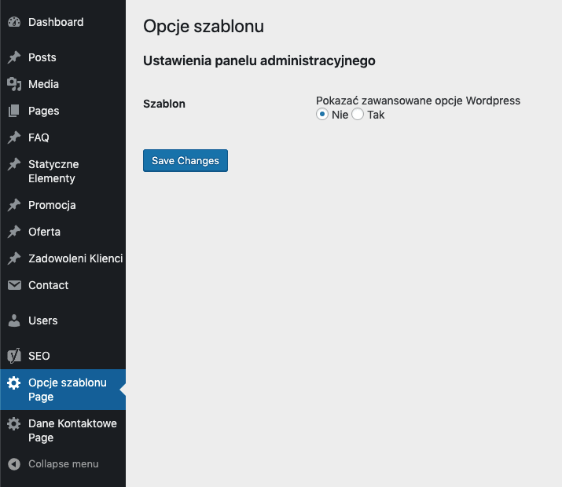

# SW-admin-theme

**Tags:** extel, bedrock, wordpress
**Tested up to:** 5.1.1
**Stable tag:** 1.0.1
**License:** MIT
**License URI:** https://www.gnu.org/licenses/gpl-2.0.html

**Plugin Name:** sw-admin-theme
**Plugin URI:** https://github.com/sebastianwesolowski/sw-admin-theme
**Description:** Simple plugin, customize wordpress admin panel
**Author:** Sebastian Wesołowski
**Author URI:** warsztatkodu.pl
**Text Domain:** sw-admin-theme
**Domain Path:** /resources/lang
**Version:** 1.0.1
**@package** sw-admin-theme

## Description

Simple plugin, customize wordpress admin panel

## Changelog

### 1.0.1

- fix to standard git/composer add licence
- removal unused item
- Add standar for readme, composer, descryption Php

### 1.0.0

- init commit
- Select advance seting or simple
- GUI to select in admin panel
- 

## TODO

- create gui panel to select hide setting
